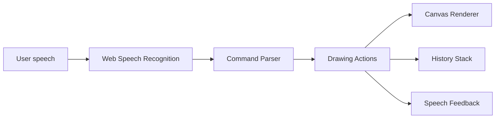

# Architecture Notes

Update this file after the topic is selected.

## Current Architecture

The selected topic is a voice-only drawing tool. The MVP uses browser-native APIs to minimize latency and operating cost.

## Design Principles

- Keep drawing local and deterministic.
- Prefer structured commands over unconstrained generation.
- Split compound commands into small operations.
- Keep undo/redo based on action history.
- Add a cloud planner later only if it improves command understanding enough to justify cost.

## Decisions

| Date | Decision | Reason | Alternatives |
| --- | --- | --- | --- |
| 2026-06-12 | Browser-only MVP | Lowest latency, zero backend cost, easy demo | Cloud LLM command planner |
| 2026-06-12 | Structured command parser | Testable and predictable | Fully generative drawing |

## Dependencies

| Dependency | Purpose | Original Work Boundary |
| --- | --- | --- |
| Browser Web Speech API | Speech recognition | Browser platform capability |
| Canvas API | Drawing renderer | Browser platform capability |
| SpeechSynthesis API | Spoken feedback | Browser platform capability |

## Evaluation

- Happy path: Speak color + shape + position and verify canvas result.
- Edge cases: Unknown command, compound command, undo/redo after clear.
- Latency: Final transcript to render should feel immediate.
- Output quality: Shapes and colors should match parsed intent.
- Demo reproducibility: Use the command list in README and demo script.
